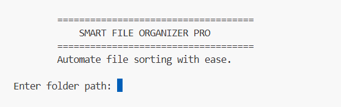
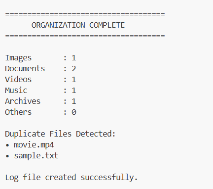
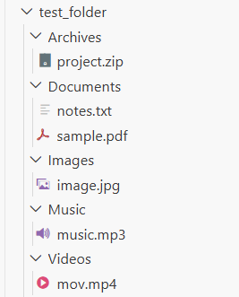

# 📂 Smart File Organizer Pro

A Python-based automation tool that intelligently organizes files into categorized folders, detects duplicate files, maintains operation logs, and supports undo functionality.

This project was built to automate one of the most common file-management problems: keeping folders organized without manually sorting files.

---

# 🚀 Features

## 1. Automatic File Categorization

The program automatically identifies file types using their extensions and moves them into dedicated folders.

### Supported Categories

| Category | Extensions |
|----------|------------|
| Images | .jpg, .jpeg, .png, .gif |
| Documents | .pdf, .doc, .docx, .txt |
| Videos | .mp4, .mkv, .avi |
| Music | .mp3, .wav |
| Archives | .zip, .rar |
| Others | Any unsupported extension |

Example:

Before:

photo.jpg
resume.pdf
movie.mp4

After:

Images/photo.jpg
Documents/resume.pdf
Videos/movie.mp4

---

## 2. Duplicate File Detection

The application uses MD5 hashing to identify duplicate files.

Instead of comparing file names, it compares file contents.

### Example

notes.txt

notes_copy.txt

If both files contain exactly the same data, they produce the same MD5 hash.

The duplicate file is detected and reported.

---

## 3. Logging System

Every operation is recorded in a log file.

Example:

[2026-06-17 14:22:05] Moved image.jpg to Images

[2026-06-17 14:22:07] Duplicate detected: notes_copy.txt

This provides traceability and makes debugging easier.

---

## 4. Undo Functionality

The organizer keeps track of every file movement.

After organization, the user can restore files to their original locations.

Example:

test_folder/resume.pdf

↓

Documents/resume.pdf

↓

Undo

↓

test_folder/resume.pdf

This demonstrates rollback and state-management concepts.

---

## 5. Statistics Dashboard

After processing files, the application displays a summary.

Example:

Images : 5

Documents : 7

Videos : 2

Music : 3

Archives : 1

Others : 0

This gives users immediate feedback about the organization process.

---

# 🛠 Technologies Used

- Python 3
- Object-Oriented Programming (OOP)
- File Handling
- OS Module
- shutil Module
- hashlib Module
- Logging
- Exception Handling

---

# 📁 Project Structure

smart-file-organizer/

├── main.py

├── organizer.py

├── logger.py

├── requirements.txt

├── README.md

├── .gitignore

├── screenshots/

└── test_folder/

---

# ⚙ How It Works

## Step 1: User Provides Folder Path

The user enters the directory that needs organization.

Example:

D:\Downloads

---

## Step 2: Program Reads Files

The application scans every file inside the target folder.

---

## Step 3: File Type Detection

Each file extension is checked.

Example:

.jpg → Images

.pdf → Documents

.mp4 → Videos

---

## Step 4: Folder Creation

If a category folder does not exist, it is created automatically.

Example:

Images/

Documents/

Videos/

---

## Step 5: File Movement

Files are moved into their respective folders.

---

## Step 6: Duplicate Detection

MD5 hashes are generated.

Files with identical hashes are marked as duplicates.

---

## Step 7: Logging

Every action is stored in the log file.

---

## Step 8: Statistics Display

A summary report is shown.

---

## Step 9: Optional Undo

The user can restore all moved files.

---

# 📚 Concepts Demonstrated

This project demonstrates:

### Object-Oriented Programming

Classes:

- FileOrganizer
- Logger

---

### File Handling

Reading and moving files using Python.

---

### Hashing

MD5 hashing for duplicate detection.

---

### Automation

Automatic file classification and sorting.

---

### Exception Handling

Graceful handling of invalid paths and unexpected errors.

---

### Logging

Recording application activity for future reference.

---

# 📸 Screenshots

## Program Start

---

## Statistics Dashboard

---

## Organized Folder Structure

---

# ▶ Running the Project

Clone the repository:

git clone <repository-url>

Move into the project folder:

cd smart-file-organizer

Run:

python main.py

Enter the folder path when prompted.

---

# Future Improvements

Potential enhancements include:

- GUI using Tkinter
- Drag-and-drop support
- Scheduled automatic organization
- Custom file categories
- Duplicate file removal
- Dark mode interface

---

# Author

Niharika Sharma

Python Automation Project
